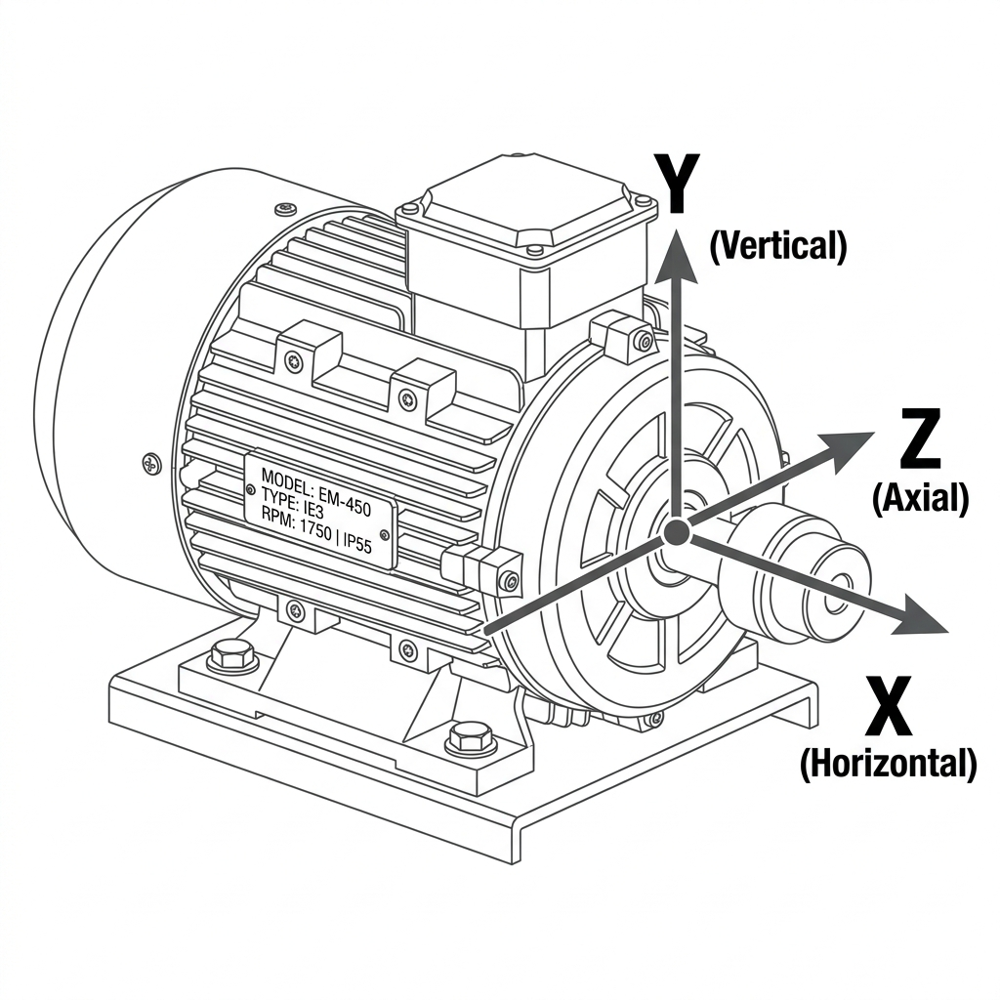

# 卧式电机振动测量三轴说明 (X, Y, Z 轴)

在工业振动监测和 ISO 相关标准中，针对卧式安装（水平放置）的旋转机械，标准的三轴向（Triaxial）定义非常明确。理解这三个方向对于正确安装传感器以及准确诊断故障至关重要。

以下为您生成的卧式电机三轴示意图：

## 三向定义与物理意义

> [!TIP]
> 传感器的安装点通常选择在电机的**驱动端（DE）**和**非驱动端（NDE）**的轴承座上，因为这里最靠近振动源且刚性传递最好。

### 1. 水平径向 (X 轴 / Horizontal Radial)
- **方向**：与电机转轴垂直，指向水平面外侧。
- **刚度特征**：在卧式设备中，水平方向通常没有地基的直接硬支撑，因此**结构刚度相对最低**。
- **敏感故障**：由于刚度低，转子在旋转过程中的离心力（如**质量不平衡**）最容易在 X 轴激发出高幅值的 1X 工频振动。

### 2. 垂直径向 (Y 轴 / Vertical Radial)
- **方向**：与电机转轴垂直，垂直于地面（重力方向）。
- **刚度特征**：垂直方向直接受到设备底座、地脚螺栓和地基的支撑，因此**结构刚度通常最高**。
- **敏感故障**：正常情况下，Y 轴的振动幅值应该低于 X 轴。如果 Y 轴振动异常偏高（特别是出现大量 1X、2X 或基础共振频率），通常强烈暗示**地脚松动（Mechanical Looseness）**、底座刚度不足或存在软脚（Soft Foot）问题。

### 3. 轴向 (Z 轴 / Axial)
- **方向**：平行于电机的转子主轴线。
- **敏感故障**：当两台设备（如电机通过联轴器连接泵）的中心线不在同一条直线上时，联轴器的每转一圈都会对转轴产生推拉的交变应力。因此，Z 轴是对**角不对中（Angular Misalignment）**和**转子弯曲（Bent Shaft）**最为敏感的方向。典型的特征是 Z 轴出现极高的 1X 或 2X 振动幅值。

## 混轴现象 (Axis Mixing) 带来的危害

> [!CAUTION]
> 混轴会导致诊断系统张冠李戴，给出完全相反的维修建议！

如果现场传感器安装方向错误（例如把传感器侧向安装，把 X 轴当成了 Z 轴）：
1. 原本是不平衡引发的剧烈**径向晃动（X）**，被系统读取成了**轴向窜动（Z）**。
2. 诊断算法会认为设备存在严重的“不对中”或“联轴器故障”。
3. 现场工人花了半天时间去重新对中（激光对中打表），开机后发现振动依然巨大，最后才发现原来转子叶轮上缺了一块（不平衡）。

为了防止这种情况，目前很多智能无线传感器会在安装时要求拍照确认，或者在软件后台提供**“坐标轴软件重映射”**的功能以备纠错。

## 传感器的正确安装位置与方式（面向硬件设计）

如果您正在规划一款适应不同电机的通用**安装底座（Mounting Base/Pad）**，必须遵循以下工业级振动测量的核心法则。

### 1. 最佳安装位置：寻找“最硬”且“最近”的节点
如上图所示，电机的振动是由内部转子产生的，然后通过轴承传递到电机外壳。因此：
- **正确位置**：必须安装在电机两端的**轴承座（Bearing Housing）**上（驱动端 DE 和非驱动端 NDE）。这里是振动从轴传递到外壳的必经之路，信号损失最小。
- **错误位置**：**绝对不要**安装在电机的散热片（Cooling Fins）、风扇罩（Fan Cover）或者薄壁接线盒上。这些部位属于“柔性结构”，会像音叉一样产生严重的局部共振，不仅测不到真实的故障频率，还会完全污染高频数据。

### 2. 轴向对齐：让物理世界与坐标系重合
在设计底座和安装传感器时，必须保证传感器的内部 MEMS/压电晶体坐标系与设备真实的 X, Y, Z 完全重合：
- 传感器的 Z 轴（如果壳体上有打标）必须**严格平行**于电机的转子主轴。
- 传感器的 Y 轴必须与重力方向（或机座支撑方向）一致。
- 传感器的底面通常代表 X/Y 平面。底座的设计必须能够提供一个绝对水平或绝对垂直的面。

### 3. 安装底座（Mounting Pad）的设计建议
对于圆柱形、带散热片的电机，很难找到一块绝对平整的地方。要设计一款“适应不同电机”的安装底座，您可以参考以下思路：

> [!IMPORTANT]
> 振动传递的黄金法则：连接界面的刚度决定了你能测到的最高频率（高频频响）。连接越软，高频信号衰减越严重。

1. **螺栓连接（Stud Mounting）—— 频响最高（首选）**
   - **方式**：在电机轴承座的坚固部位钻孔并攻丝，传感器通过螺栓直接拧入。
   - **底座设计**：无需额外转接，这是测高频（如 10kHz 以上包络）的唯一可靠方式。
2. **胶粘安装底座（Adhesive Mounting Pad）—— 工业最通用**
   - **方式**：设计一个金属小圆盘（如不锈钢材质），底面涂上高强度工业胶（如乐泰胶或环氧树脂）粘在电机上；圆盘顶部带有标准螺纹孔，传感器拧在圆盘上。
   - **底座设计**：为了适应曲面，底座的底部可以设计成**微凹的弧面**，或者体积做得足够小以适应不同曲率，依靠环氧树脂胶来填补缝隙。
3. **磁吸底座（Magnetic Base）—— 适用于临时巡检**
   - **方式**：底部带有强磁铁，直接吸附在铸铁电机壳上。
   - **底座设计**：可以设计成**两点式（双极）磁座**，底部是一个 V 型槽，这样不管电机外壳的弧度多大，都能通过两点稳稳吸附，不会晃动。但注意，磁吸会极大地降低系统的高频响应截止频率（通常在 2kHz 以上信号就会衰减），因此不适合永久在线监测和早期轴承诊断。

在您的项目中，如果要做在线监测，最推荐的设计是：**提供一个底部略带微弧度（或体积小巧）、顶部带螺孔的不锈钢安装块（Pad），施工时用结构胶将其粘在清理掉漆皮的轴承座上，再把传感器拧上去。** 这既保证了方向的准确性，又保证了高频信号的传递。
