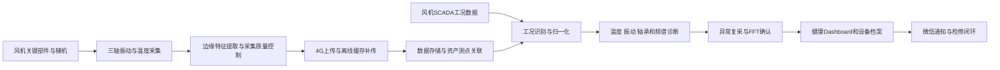

# 风力发电行业设备监测与诊断解决方案分析

## 1. 文档目的

本文基于当前设备端固件、后端平台和诊断服务的实际功能，结合风力发电机组的设备结构、运行工况和运维特点，分析现有产品在风电行业中的适用场景、产品定位、能力缺口和落地路径。

本文用于支持后续：

- 风电行业解决方案书编制；
- 客户交流和售前需求分析；
- 产品能力边界说明；
- 风电专项研发规划；
- 试点项目设计与验收指标制定。

> 本文结论来自源代码静态分析和行业公开资料研究。设备在风机现场的信号质量、环境适应性、通信可靠性及故障识别效果，仍需通过现场试点验证。

## 2. 总体结论

现有产品具备进入风电行业的基础条件，但不应直接定位为替代风机原有保护系统或全功能在线状态监测系统（CMS）。

推荐的产品定位是：

> **风机传动链与舱内辅机的低改造成本智能点检及远程诊断系统，作为现有 SCADA、OEM CMS 和人工巡检体系的补充。**

现阶段最适合的应用方向包括：

1. 发电机轴承监测；
2. 齿轮箱高速级轴承及外部轴承座监测；
3. 液压泵、润滑泵、冷却风机等舱内辅机监测；
4. 偏航和变桨驱动电机的动作期监测；
5. 存量风机监测补点；
6. 跨品牌、跨风场设备健康统一管理。

主轴承、齿轮箱行星级、直驱发电机低速轴承等场景具有潜在价值，但需要增加实时转速、负载和运行状态数据，并开发风电专用的变速变载诊断算法。

## 3. 现有设备端功能特性

### 3.1 感知与采集能力

设备端当前具备：

- IIS3DWB 三轴振动采集；
- DS18B20 接触式温度采集；
- 26.667 kHz 振动采样频率；
- ±2g、±4g、±8g、±16g 多量程；
- 振动削峰检测；
- 削峰后自动提升量程并重新采集；
- X、Y、Z 三轴独立数据质量记录；
- 周期采集和服务器任务触发采集；
- 振动唤醒采集能力；
- FFT 专项采集和二进制频谱上传。

采集配置和基础能力可见：

- `components/task/src/report_pipeline.c`
- `components/peri/src/drv_iis3dwb.c`
- `components/peri/src/drv_ds18b20.c`

### 3.2 边缘计算能力

设备端能够在本地完成三轴振动特征提取，减少日常通信数据量。

当前已计算的主要指标包括：

#### 时域特征

- 加速度平均值；
- 加速度有效值；
- 加速度峰值；
- 加速度峰峰值；
- 振动速度有效值；
- 峰值因子；
- 峭度。

#### 频域特征

- 主要频谱峰值及对应频率；
- 频谱质心；
- 频谱熵；
- 分频段能量占比；
- 10～100 Hz、100～500 Hz、500～1000 Hz 分段速度有效值；
- 最高 5 kHz 的常规频谱特征分析。

#### 轴承特征

在已配置轴承参数和有效转速的条件下，设备端可以计算：

- 包络峭度；
- BPFO：轴承外圈故障特征；
- BPFI：轴承内圈故障特征；
- BSF：滚动体故障特征；
- FTF：保持架故障特征；
- 多阶谐波候选；
- 候选频率信噪比。

这使设备具备“边缘提取候选证据、服务端完成定级和解释”的基础能力。

### 3.3 设备通信与自治能力

当前固件具备：

- 4G 独立通信；
- 设备绑定和服务器配置同步；
- RTC 相对时间调度；
- 深度睡眠和定时唤醒；
- 采样结束后启动通信，降低通信对振动采样的干扰；
- 采样后计算与 4G 网络准备并行执行；
- 上传失败时在本地保存报告；
- 网络恢复后按时间顺序补传历史报告；
- 在历史报告中标记延迟时间和剩余数量；
- 远程固件升级；
- OTA 前刷新设备绑定和算法配置；
- 固件启动验证及升级结果上报；
- 电池电压、信号强度和设备状态上报。

相关实现主要位于：

- `components/task/src/task_daq.c`
- `components/task/src/report_upload_cache.c`
- `components/task/src/task_binding.c`
- `components/task/src/task_ota.c`

### 3.4 远程任务能力

平台可以向设备下发：

- 固件升级任务；
- 配置更新任务；
- 状态上报任务；
- 绑定更新任务；
- 指定间隔和次数的密集复采任务；
- 振动异常三次确认复采任务；
- FFT 专项采集任务。

设备在数据上传响应中取得任务，因此可以在一次工作周期内完成“上报—决策—复采/FFT”的闭环。

## 4. 后端平台与诊断服务功能特性

### 4.1 资产与租户管理

平台具备多租户资产管理能力，可以组织：

- 租户；
- 区域和风场；
- 工艺或设备组合；
- 设备类别；
- 设备规格；
- 设备实例；
- 监测位置；
- 传感器；
- 传感器批次和 SIM 卡；
- 传感器与设备测点的绑定关系。

传感器绑定采用版本化记录。传感器更换或转移后，历史数据仍可保留原来的设备和测点归属。

该能力可以映射为：

```text
租户
└── 风场/区域
    └── 风力发电机组
        ├── 主轴承测点
        ├── 齿轮箱测点
        ├── 发电机驱动端测点
        ├── 发电机非驱动端测点
        └── 舱内辅机测点
```

### 4.2 数据接收、存储与追溯

平台当前具备：

- 设备报告接收；
- 服务端统一生成采样时间；
- 根据设备上报的延迟时间恢复历史采样时间；
- 按采样时刻查询当时有效的传感器绑定；
- 原始报告存入 MinIO；
- 时序指标进入时序存储；
- 诊断状态和业务结果进入 MySQL；
- 使用 Redis Stream 解耦接收、持久化和诊断；
- FFT 原始二进制独立存储和异步分析；
- 原始报告、诊断结果、设备、测点和任务之间的关联追溯。

这套机制特别适合风场网络不稳定、设备离线补传和传感器更换等实际情况。

### 4.3 诊断能力

#### 温度诊断

当前温度诊断不是单纯的固定阈值比较，还包括：

- 绝对温度红线；
- 与环境温度比较；
- 与上一次记录比较的温度突变；
- 24 小时短期趋势；
- 72 小时中期趋势；
- 线性回归斜率；
- 温度振幅；
- 同规格设备横向比较；
- 设备自身健康基线比较。

#### 振动诊断

当前振动诊断包括：

- 绝对振动阈值；
- 振动预算占比；
- 设备动态健康基线；
- 振动突变；
- 短期和中期趋势；
- 趋势斜率和振幅；
- 同规格设备横向比较；
- 异常后复采确认。

#### 轴承与 FFT 诊断

平台可以结合测点绑定的轴承型号、轴承几何参数和轴速计算特征阶次，并对设备上传的候选频率进行复核，形成：

- 故障类型；
- 故障轴向；
- 严重程度；
- 观测频率与理论频率偏差；
- 谐波数量；
- 最佳信噪比；
- 诊断证据明细。

诊断结果采用五级健康等级：

| 等级 | 含义 |
|---|---|
| 0 | 正常 |
| 1 | 关注 |
| 2 | 异常 |
| 3 | 告警 |
| 4 | 严重/危险 |

### 4.4 异常确认闭环

系统当前支持：

1. 常规报告发现振动异常；
2. 服务端创建连续三次复采任务；
3. 设备每 5 分钟完成一次完整复采；
4. 最终复采仍然异常时下发 FFT；
5. 设备立即进行 FFT 采集并上传；
6. 服务端保存 FFT 结果和诊断证据；
7. 形成客户通知和健康档案。

该闭环可以减少偶发冲击、安装干扰或瞬态工况导致的单次误报。

### 4.5 客户端与通知能力

平台已经具备：

- 设备健康总览；
- 正常、关注、异常、告警、严重、未检测、离线等状态统计；
- 按设备类型、区域和故障指标统计问题分布；
- 当前异常设备清单；
- 异常次数和首次/最近检出时间；
- 全年异常检出热力图；
- 设备健康档案；
- 测点趋势；
- 当前传感器绑定展示；
- 微信用户绑定；
- 按员工、设备类别或业务区域路由通知；
- 通知去重、状态记录和失败重试；
- 微信诊断详情页面及规则证据展示。

## 5. 风电行业特点

### 5.1 设备特点

风力发电机组不是稳定转速、稳定负载的普通旋转机械，主要特点包括：

- 风速持续变化；
- 转子、齿轮箱各级轴和发电机转速不同；
- 功率和机械负载不断变化；
- 启停、偏航、变桨、限功率和并网状态并存；
- 齿轮箱行星级信号传递路径复杂；
- 主轴承和行星级轴承转速较低；
- 塔筒、叶片和机舱存在明显低频结构振动；
- 海上风机还会受到海浪、盐雾和维护窗口限制。

因此，普通旋转机械的固定阈值不能直接作为风机故障判断依据。

### 5.2 运维特点

- 单台机组停机损失较大；
- 大部件吊装和更换成本高；
- 海上风场受船舶、天气和备件供应限制；
- 人工登塔巡检成本和安全风险高；
- 风场通常同时存在多个主机厂家和机型；
- OEM 系统数据开放程度不一致；
- 客户更需要提前安排检修窗口，而不只是收到报警。

状态监测的核心价值是减少突发停机、避免故障扩大，并把检修安排在低风期或计划停机窗口。

## 6. 产品与风电场景的匹配分析

### 6.1 第一优先级：现有能力匹配度高

#### 6.1.1 发电机轴承

推荐测点：

- 发电机驱动端轴承；
- 发电机非驱动端轴承。

可以使用：

- 三轴振动；
- 温度趋势；
- 振动速度有效值；
- 峭度和峰值因子；
- 包络分析；
- BPFO、BPFI、BSF、FTF；
- 异常复采和 FFT 确认。

这是当前产品最适合优先验证的风机主设备场景之一。

#### 6.1.2 齿轮箱高速级轴承及外部轴承座

适合监测：

- 高速轴轴承；
- 中间级外部可达轴承座；
- 齿轮箱壳体关键位置。

当前可识别轴承冲击、振动能量增长、温升和异常频谱，但尚未形成完整的齿轮啮合与侧带诊断。

#### 6.1.3 舱内辅机

优先考虑：

- 齿轮箱润滑泵；
- 液压站泵和电机；
- 冷却风机；
- 变流器和变压器冷却设备；
- 偏航和变桨驱动电机。

这些设备更接近普通旋转机械，现有振动、温度、趋势和轴承诊断能力可以较快应用。

#### 6.1.4 存量风机补点

典型场景包括：

- 风机没有安装 CMS；
- OEM CMS 测点覆盖不足；
- 原监测系统停服或备件困难；
- 希望增加临时观察点；
- 希望将不同品牌机组纳入统一健康平台。

独立 4G、离线缓存和低耦合部署是该场景的主要优势。

### 6.2 第二优先级：需要风电专项增强

| 部件/场景 | 当前可用能力 | 主要缺口 |
|---|---|---|
| 主轴承 | 温度、宽带振动、冲击趋势 | 低速采集、实时转速、阶次分析、长周期工况基线 |
| 齿轮箱行星级 | 壳体振动、异常趋势、FFT | 行星级信号分离、齿轮啮合频率、侧带和变速补偿 |
| 齿轮箱中间级 | 轴承特征和趋势 | 多轴速映射、速比配置、运行负载关联 |
| 直驱发电机轴承 | 温升、宽带振动 | 极低转速阶次分析和低频测量能力 |
| 偏航/变桨齿轮箱 | 动作期间振动和温度 | 与动作状态同步的触发采集和专用基线 |

### 6.3 暂不建议作为当前主卖点

- 叶片裂纹；
- 叶片结冰；
- 塔筒、基础和浮式平台结构健康；
- 风机安全保护和跳机控制；
- 润滑油颗粒及含水量；
- 齿轮箱油液磨损分析；
- 发电机和变流器电气故障；
- 精确剩余寿命预测。

这些场景需要应变、低频结构振动、油液、电流、电压、气象数据或长期故障样本等额外能力。

## 7. 当前能力缺口与风险

### 7.1 缺少同步实时工况数据

当前设备的轴承特征计算依赖配置中的固定转速，而风机在运行中通常持续变速、变载。

需要接入：

- 转子实时转速；
- 发电机实时转速；
- 有功功率；
- 风速；
- 桨距角；
- 偏航状态；
- 并网、停机、限功率和故障状态。

没有这些数据时，振动变化可能来自工况变化，而不一定来自设备劣化。

### 7.2 缺少风电专用频谱算法

当前已有轴承特征频率诊断，但尚未发现以下完整能力：

- 同步阶次跟踪；
- 变转速频谱重采样；
- 齿轮啮合频率诊断；
- 齿轮啮合侧带分析；
- 行星级调制分析；
- 不同轴系速比自动换算；
- 按功率和转速工况归一化。

### 7.3 低频能力需要专项验证

当前常规振动速度主要分析 10～1000 Hz，适合一般旋转机械，但主轴、塔筒、叶片和海上平台包含重要低频成分。

因此需要验证：

- 传感器低频响应；
- 安装方式对低频测量的影响；
- 采样时长是否覆盖足够转数；
- 主轴低速条件下的频率分辨率；
- 是否需要更长连续波形或其他传感器。

### 7.4 当前系统不是连续保护系统

现有产品采用周期唤醒、特征上报、异常复采和 FFT 确认，更接近智能点检系统。

它不应承担：

- 实时跳机保护；
- 超速保护；
- 安全链控制；
- 毫秒级连续故障保护。

解决方案文件中应明确“状态监测”和“安全保护”的边界。

### 7.5 环境与工程适应性尚需证明

风机部署前需要补充验证：

- 防护等级；
- 高低温；
- 湿热和凝露；
- 海上盐雾和腐蚀；
- 电磁兼容；
- 雷击及浪涌环境；
- 传感器安装强度和长期稳定性；
- 电池寿命或外部供电方案；
- 机舱内部 4G 信号及外置天线；
- 现场防火和认证要求。

### 7.6 通信安全需要生产化确认

当前固件部分接口在源代码中使用 HTTP 地址。正式风电项目需要结合实际网络拓扑确认：

- 是否通过专网、VPN 或网关隔离；
- 是否需要设备端 HTTPS；
- 设备身份认证和密钥更新；
- OTA 文件完整性及签名验证；
- 客户数据隔离和审计。

## 8. 建议的风电专项产品演进

### 8.1 第一阶段：形成可销售的基础方案

目标：以现有产品为主，最小化研发投入。

重点场景：

- 发电机轴承；
- 齿轮箱高速级轴承；
- 舱内泵、风机和驱动电机；
- 存量风机监测补点。

需要完成：

- 风机资产和测点模板；
- 风机部件名称和故障分类；
- 风电解决方案 Dashboard；
- 风场—机组—部件—测点的展示路径；
- 风电版本诊断报告和微信通知文案；
- 现场安装标准和验收规范。

### 8.2 第二阶段：接入 SCADA 工况

增加：

- SCADA/API/文件数据接入；
- 风机运行状态识别；
- 转速、功率和风速同步；
- 按转速和负载区间建立基线；
- 同型号机组同工况横向比较；
- 异常发生时的工况证据展示。

数据模型和接口可参考 IEC 61400-25-6 的风电状态监测信息模型。

### 8.3 第三阶段：开发风电专用诊断

增加：

- 阶次跟踪；
- 齿轮啮合频率和侧带；
- 行星级特征；
- 主轴低速轴承策略；
- 直驱机组诊断模型；
- 基于工况的异常置信度；
- 故障案例库和检修反馈闭环。

## 9. 建议的解决方案架构



## 10. 面向客户的核心价值

解决方案不应只描述传感器和算法，而应回答客户的运维问题。

### 10.1 客户需要知道什么

- 哪个风场存在问题；
- 哪台风机存在问题；
- 哪个部件和测点存在问题；
- 是温度、宽带振动还是轴承冲击异常；
- 异常是否经过复采确认；
- 当前严重程度和发展趋势；
- 是否需要立即停机、近期检查或持续观察；
- 历史上出现过多少次；
- 检修后指标是否恢复。

### 10.2 可表达的业务价值

- 减少人工登塔和无效定期巡检；
- 提前发现轴承及传动部件劣化；
- 避免小故障扩大为齿轮箱或发电机大修；
- 将维修安排到低风期或计划停机窗口；
- 降低突发停机和备件调度风险；
- 对多个风场和多品牌机组形成统一健康视图；
- 保存完整诊断证据，支持检修决策和效果验证。

## 11. 建议的首期试点

### 11.1 试点选择

优先选择：

- 陆上风场；
- 同一机型的少量机组；
- 具备基本 SCADA 数据导出条件；
- 存在明确巡检痛点或历史故障的机组；
- 现场 4G 信号可验证。

### 11.2 推荐测点

- 发电机驱动端；
- 发电机非驱动端；
- 齿轮箱高速轴轴承座；
- 润滑泵或液压泵；
- 冷却风机；
- 主轴承作为专项验证点。

### 11.3 试点验收指标

建议至少验证：

- 数据完整率；
- 周期采集准时率；
- 离线补传成功率；
- 4G 通信成功率；
- 设备功耗和预计续航；
- 不同测点的信号质量；
- 削峰和自动量程有效性；
- 异常复采及 FFT 闭环成功率；
- 正常工况误报率；
- 与人工点检或原 CMS 结论的一致性；
- 安装工时及维护便利性；
- 检修前后指标变化。

## 12. 建议的对外方案名称

推荐使用：

> **风力发电机组传动链与辅机智能点检解决方案**

可选宣传语：

> 以独立智能传感、边缘特征分析、远程复采确认和设备健康档案，为存量风机提供低改造成本、可追溯的状态监测与诊断服务。

不建议在尚未完成专项验证前使用：

- 全机组故障预测；
- 替代风机 CMS；
- 精确预测剩余寿命；
- 覆盖所有风机故障；
- 零误报；
- 风机安全保护系统。

## 13. 行业依据

1. [ISO 20816-21:2025：水平轴风力发电机组机械振动测量与评价](https://www.iso.org/cms/%20render/live/en/sites/isoorg/contents/data/standard/08/42/84280.html)
   - 覆盖带齿轮箱和直驱型水平轴风机；
   - 强调风、海浪、叶片和塔筒引起的低频振动影响；
   - 指出宽带振动评价区间通常不适合直接用于早期故障发现。

2. [IEC 61400-25-6：风电场状态监测信息模型](https://webstore.iec.ch/en/publication/5443)
   - 规定风力发电场状态监测相关的信息模型和数据交换方式；
   - 可作为平台与风场 SCADA 或第三方系统集成的参考。

3. [NREL：风力发电机组传动链状态监测综述](https://www.nrel.gov/docs/fy12osti/50698.pdf)
   - 状态监测可降低灾难性故障风险并改善运维决策；
   - 齿轮箱是停机时间长、维护成本高的重要子系统。

4. [NREL：变工况行星齿轮箱状态监测研究](https://research-hub.nrel.gov/en/publications/condition-monitoring-of-wind-turbine-planetary-gearboxes-under-di-3/)
   - 轴承故障振动特征可能弱于齿轮信号；
   - 速度和负载变化会显著增加故障与工况变化的区分难度。

5. [NREL：SCADA 与模型数据用于齿轮箱轴承故障预测](https://research-hub.nrel.gov/en/publications/prognosis-of-wind-turbine-gearbox-bearing-failures-using-scada-an-2/)
   - SCADA 能提供风机低频运行工况；
   - 将运行数据与设备设计及模型数据结合，有助于提高预测效果并降低误报。

6. [美国能源部：海上风电结构健康监测与运维成本](https://www.energy.gov/cmei/systems/articles/sandia-national-laboratories-structural-health-monitoring-and-prognostics)
   - 海上风电维护受到天气和物流窗口限制；
   - 状态维护和预测信息有助于减少非计划维护并优化集中检修。

## 14. 后续输出建议

以本文为基础，可继续形成以下材料：

1. 《风电行业客户需求与痛点分析》；
2. 《风机部件—故障模式—监测指标映射表》；
3. 《风电行业产品能力差距与研发路线图》；
4. 《风电试点项目技术方案》；
5. 《风电行业售前解决方案 PPT》；
6. 《风机现场安装与测点选择规范》；
7. 《风电专项诊断算法需求规格书》；
8. 《试点验收指标及测试记录表》。
